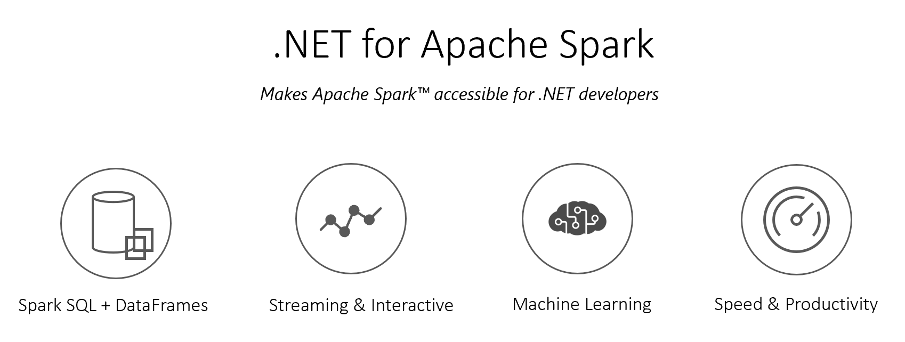
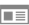

# .NET for Apache® Spark™

.NET for Apache Spark provides high performance APIs for using [Apache Spark](https://spark.apache.org/) from C# and F#. With these .NET APIs, you can access the most popular Dataframe and SparkSQL aspects of Apache Spark, for working with structured data, and Spark Structured Streaming, for working with streaming data. 

.NET for Apache Spark is compliant with .NET Standard - a formal specification of .NET APIs that are common across .NET implementations. This means you can use .NET for Apache Spark anywhere you write .NET code allowing you to reuse all the knowledge, skills, code, and libraries you already have as a .NET developer. 

.NET for Apache Spark runs on Windows, Linux, and macOS using .NET 8, or Windows using .NET Framework. It also runs on all major cloud providers including [Azure HDInsight Spark](deployment/README.md#azure-hdinsight-spark), [Amazon EMR Spark](deployment/README.md#amazon-emr-spark), [AWS](deployment/README.md#databricks) & [Azure](deployment/README.md#databricks) Databricks.

**Note**: We currently have a Spark Project Improvement Proposal JIRA at [SPIP: .NET bindings for Apache Spark](https://issues.apache.org/jira/browse/SPARK-27006) to work with the community towards getting .NET support by default into Apache Spark. We highly encourage you to participate in the discussion. 

## Table of Contents

- [Supported Apache Spark](#supported-apache-spark)
- [Releases](#releases)
- [Get Started](#get-started)
- [Build Status](#build-status)
- [Building from Source](#building-from-source)
- [Samples](#samples)
- [Contributing](#contributing)
- [Inspiration and Special Thanks](#inspiration-and-special-thanks)
- [How to Engage, Contribute and Provide Feedback](#how-to-engage-contribute-and-provide-feedback)
- [Support](#support)
- [.NET Foundation](#net-foundation)
- [Code of Conduct](#code-of-conduct)
- [License](#license)

## Supported Apache Spark

<table>
    <thead>
        <tr>
            <th>Apache Spark</th>
            <th>.NET for Apache Spark</th>
        </tr>
    </thead>
    <tbody align="center">
        <tr>
            <td>2.4*</td>
            <td rowspan=5><a href="https://github.com/dotnet/spark/releases/tag/v2.1.1">v2.1.1</a></td>
        </tr>
        <tr>
            <td>3.0</td>
        </tr>
        <tr>
            <td>3.1</td>
        </tr>
        <tr>
            <td>3.2</td>
        </tr>        
        <tr>
            <td>3.5</td>
        </tr>
    </tbody>
</table>

*2.4.2 is <a href="https://github.com/dotnet/spark/issues/60">not supported</a>.

## Releases

.NET for Apache Spark releases are available [here](https://github.com/dotnet/spark/releases) and NuGet packages are available [here](https://www.nuget.org/packages/Microsoft.Spark).

## Get Started
These instructions will show you how to run a .NET for Apache Spark app using .NET 8.
- [Windows Instructions](docs/getting-started/windows-instructions.md)
- [Ubuntu Instructions](docs/getting-started/ubuntu-instructions.md)
- [MacOs Instructions](docs/getting-started/macos-instructions.md)

## Build Status

|  |  |
| :---:         |          :---: |
| Ubuntu | Windows |
| | |

## Building from Source

Building from source is very easy and the whole process (from cloning to being able to run your app) should take less than 15 minutes!

| |  | Instructions |
| :---: | :---         |      :--- |
|  | **Windows**    | <ul><li>Local - [.NET Framework 4.8](docs/building/windows-instructions.md#using-visual-studio-for-net-framework)</li><li>Local - [.NET 8](docs/building/windows-instructions.md#using-net-core-cli-for-net-core)</li><ul>    |
|  | **Ubuntu**     | <ul><li>Local - [.NET 8](docs/building/ubuntu-instructions.md)</li><li>[Azure HDInsight Spark - .NET 8](deployment/README.md)</li></ul>      |

## Samples

There are two types of samples/apps in the .NET for Apache Spark repo:

*  Getting Started - .NET for Apache Spark code focused on simple and minimalistic scenarios.

*   End-End apps/scenarios - Real world examples of industry standard benchmarks, usecases and business applications implemented using .NET for Apache Spark. 

We welcome contributions to both categories!

<table>
 <tr>
   <td width="25%">
      <h4><b>Analytics Scenario</b></h4>
  </td>
  <td>
      <h4 width="35%"><b>Description</b></h4>
  </td>
  <td>
      <h4><b>Scenarios</b></h4>
  </td>
 </tr>
 <tr>
   <td width="25%">
      <h5>Dataframes and SparkSQL</h5>
  </td>
  <td width="35%">
  Simple code snippets to help you get familiarized with the programmability experience of .NET for Apache Spark.
  </td>
    <td>
      <h5>Basic &nbsp;&nbsp;&nbsp;
      <a href="examples/Microsoft.Spark.CSharp.Examples/Sql/Batch/Basic.cs">C#</a> &nbsp; &nbsp; <a href="examples/Microsoft.Spark.FSharp.Examples/Sql/Basic.fs">F#</a>&nbsp;&nbsp;&nbsp;</h5>
  </td>
 </tr>
 <tr>
   <td width="25%">
      <h5>Structured Streaming</h5>
  </td>
  <td width="35%">
      Code snippets to show you how to utilize Apache Spark's Structured Streaming (<a href="https://spark.apache.org/docs/2.3.1/structured-streaming-programming-guide.html">2.3.1</a>, <a href="https://spark.apache.org/docs/2.3.2/structured-streaming-programming-guide.html">2.3.2</a>, <a href="https://spark.apache.org/docs/2.4.1/structured-streaming-programming-guide.html">2.4.1</a>, <a href="https://spark.apache.org/docs/latest/structured-streaming-programming-guide.html">Latest</a>)
  </td>
  <td>
      <h5>Word Count &nbsp;&nbsp;&nbsp;
      <a href="examples/Microsoft.Spark.CSharp.Examples/Sql/Streaming/StructuredNetworkWordCount.cs">C#</a> &nbsp;&nbsp;&nbsp;<a href="examples/Microsoft.Spark.FSharp.Examples/Sql/Streaming/StructuredNetworkWordCount.fs">F#</a> &nbsp;&nbsp;&nbsp;</h5>
      <h5>Windowed Word Count &nbsp;&nbsp;&nbsp;<a href="examples/Microsoft.Spark.CSharp.Examples/Sql/Streaming/StructuredNetworkWordCountWindowed.cs">C#</a> &nbsp; &nbsp;<a href="examples/Microsoft.Spark.FSharp.Examples/Sql/Streaming/StructuredNetworkWordCountWindowed.fs">F#</a> &nbsp;&nbsp;&nbsp;</h5>      
      <h5>Word Count on data from <a href="https://kafka.apache.org/">Kafka</a> &nbsp;&nbsp;&nbsp;<a href="examples/Microsoft.Spark.CSharp.Examples/Sql/Streaming/StructuredKafkaWordCount.cs">C#</a> &nbsp;&nbsp;&nbsp;<a href="examples/Microsoft.Spark.FSharp.Examples/Sql/Streaming/StructuredKafkaWordCount.fs">F#</a> &nbsp; &nbsp;&nbsp;</h5>
  </td>
 </tr>
 <tr>
   <td width="25%">
      <h4>TPC-H Queries</h4>
  </td>
  <td width="35%">
  Code to show you how to author complex queries using .NET for Apache Spark.
  </td>
  <td>
      <h5>TPC-H Functional &nbsp;&nbsp;&nbsp;
      <a href="benchmark/csharp/Tpch/TpchFunctionalQueries.cs">C#</a> &nbsp;&nbsp;&nbsp;</h5>
      <h5>TPC-H SparkSQL &nbsp;&nbsp;&nbsp;
      <a href="benchmark/csharp/Tpch/TpchSqlQueries.cs">C#</a>  &nbsp;&nbsp;&nbsp;</h5>
  </td>
</tr>
 </tr> 
 </table>

## Contributing

We welcome contributions! Please review our [contribution guide](CONTRIBUTING.md).

## Inspiration and Special Thanks

This project would not have been possible without the outstanding work from the following communities:

- [Apache Spark](https://spark.apache.org/): Unified Analytics Engine for Big Data, the underlying backend execution engine for .NET for Apache Spark
- [Mobius](https://github.com/Microsoft/Mobius): C# and F# language binding and extensions to Apache Spark, a pre-cursor project to .NET for Apache Spark from the same Microsoft group.
- [PySpark](https://spark.apache.org/docs/latest/api/python/index.html): Python bindings for Apache Spark, one of the implementations .NET for Apache Spark derives inspiration from. 
- [sparkR](https://spark.apache.org/docs/latest/sparkr.html): one of the implementations .NET for Apache Spark derives inspiration from.
- [Apache Arrow](https://arrow.apache.org/): A cross-language development platform for in-memory data. This library provides .NET for Apache Spark with efficient ways to transfer column major data between the JVM and .NET CLR.
- [Pyrolite](https://github.com/irmen/Pyrolite) - Java and .NET interface to Python's pickle and Pyro protocols. This library provides .NET for Apache Spark with efficient ways to transfer row major data between the JVM and .NET CLR. 
- [Databricks](https://databricks.com/): Unified analytics platform. Many thanks to all the suggestions from them towards making .NET for Apache Spark run on Azure and AWS Databricks.

## How to Engage, Contribute and Provide Feedback

The .NET for Apache Spark team encourages [contributions](docs/contributing.md), both issues and PRs. The first step is finding an [existing issue](https://github.com/dotnet/spark/issues) you want to contribute to or if you cannot find any, [open an issue](https://github.com/dotnet/spark/issues?utf8=%E2%9C%93&q=is%3Aissue+is%3Aopen+).

## Support

[.NET for Apache Spark](https://github.com/dotnet/spark) is an open source project under the [.NET Foundation](https://dotnetfoundation.org/) and 
does not come with Microsoft Support unless otherwise noted by the specific product. For issues with or questions about .NET for Apache Spark, please [create an issue](https://github.com/dotnet/spark/issues). The community is active and is monitoring submissions.

## .NET Foundation

The .NET for Apache Spark project is part of the [.NET Foundation](http://www.dotnetfoundation.org).

## Code of Conduct

This project has adopted the code of conduct defined by the [Contributor Covenant](https://contributor-covenant.org/)
to clarify expected behavior in our community.
For more information, see the [.NET Foundation Code of Conduct](https://dotnetfoundation.org/code-of-conduct).

## License

.NET for Apache Spark is licensed under the [MIT license](LICENSE).
