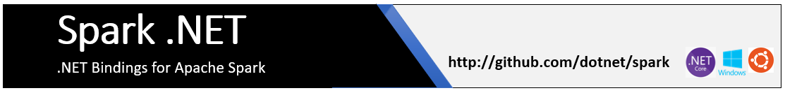

# Spark .NET

Spark .NET is the .NET API for [Apache Spark](https://spark.apache.org/).

## Build Status
|  |  |  |
| :---:         |     :---:      |          :---: |
| Ubuntu 16.04 | Ubuntu 18.04 | Windows 10 |
| | | |

## Table of Contents

- [Introduction](#introduction)
- [Quick Start (TL;DR)](#quick-start)
- [Features](docs/features.md)
- [FAQ/Troubleshooting](#faq)
- [Inspiration and Special Thanks](#inspiration)
- [How to Engage, Contribute and Provide Feedback](#community)
- [.NET Foundation](#net-foundation)
- [Code of Conduct](#code-of-conduct)
- [License](#license)

## Introduction

## Quick Start (TL;DR)

Spark .NET will be redistributed as a Nuget package and a formal release here on Github eventually to help you build your applications easily. Until then, please feel free to build it locally on your machine and link it appropriately. Building from source is very easy and the whole process (from cloning to being able to run your app) should take less than 15 minutes!

| |  | Instructions |
| :---: | :---         |      :--- |
|  | **Windows**    | <ul><li>Local - [.NET Framework 4.6.1](docs/building/windows-instructions.md#using-visual-studio-for-net-framework-461)</li><li>Local - [.NET Core 2.1.x](docs/building/windows-instructions.md#using-net-core-cli-for-net-core-21x)</li><ul>    |
|  | **Ubuntu**     | <ul><li>Local - [.NET Core 2.1.x](docs/building/ubuntu-instructions.md)</li><li>[Azure HDInsight Spark - .NET Core 2.1.x](deployment/README.md)</li></ul>      |

## Contributing
We welcome contributions! Please review our [contribution guide](CONTRIBUTING.md).

## Features

## Frequently Asked Questions 
 

## Inspiration

## Community

## How to Engage, Contribute and Provide Feedback

The Spark .NET team encourages [contributions](docs/contributing.md), both issues and PRs. The first step is finding an [existing issue](https://github.com/dotnet/spark/issues) you want to contribute to or if you cannot find any, [open an issue](https://github.com/dotnet/spark/issues?utf8=%E2%9C%93&q=is%3Aissue+is%3Aopen+).

## .NET Foundation

The Spark .NET project is part of the [.NET Foundation](http://www.dotnetfoundation.org).

## Code of Conduct

This project has adopted the code of conduct defined by the Contributor Covenant
to clarify expected behavior in our community.
For more information, see the [.NET Foundation Code of Conduct](https://dotnetfoundation.org/code-of-conduct).

## License

.NET for Apache Spark is licensed under the [MIT license](LICENSE).
