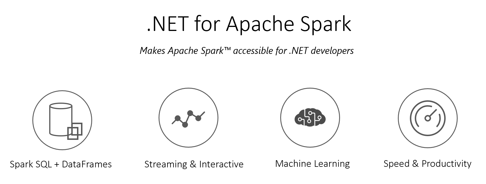

# .NET for Apache® Spark™

[![CI (main)][ci-main]][ci-report]

.NET for Apache Spark provides high-performance APIs for using [Apache Spark](https://spark.apache.org/) from C# and F#. Use DataFrames and Spark SQL to work with structured data, and Structured Streaming to process streaming data.

`Microsoft.Spark` targets .NET Standard 2.0 and 2.1. Running an application also requires a compatible .NET Worker, Apache Spark runtime, and Scala bridge. The Worker runs on Windows, Linux, and macOS using .NET 8, or on Windows using .NET Framework.

Deployment guides are available for [Azure HDInsight Spark](deployment/README.md#azure-hdinsight-spark), [Amazon EMR Spark](deployment/README.md#amazon-emr-spark), and [Databricks on AWS and Azure](deployment/README.md#databricks). Check the target platform's runtime and Worker compatibility before following a guide; these guides do not validate every managed-service runtime.

For background on the proposal for upstream .NET bindings, see [SPIP: .NET bindings for Apache Spark](https://issues.apache.org/jira/browse/SPARK-27006).

## Table of Contents

- [Supported Apache Spark](#supported-apache-spark)
- [Releases](#releases)
- [Get Started](#get-started)
- [Building from Source](#building-from-source)
- [Samples](#samples)
- [Test Status](#test-status)
- [Contributing](#contributing)
- [Inspiration and Special Thanks](#inspiration-and-special-thanks)
- [How to Engage, Contribute and Provide Feedback](#how-to-engage-contribute-and-provide-feedback)
- [Support](#support)
- [.NET Foundation](#net-foundation)
- [Code of Conduct](#code-of-conduct)
- [License](#license)

## Supported Apache Spark

The next release removes Apache Spark 2.x support and retains the Spark 3.0 through 3.5 runtime lines. See the [migration guide](docs/migration-guide.md#upgrading-after-spark-2x-support-removal) before upgrading an existing application.

The getting-started examples use Spark 3.5.3 with Scala 2.12. Current source targets Spark 4.0.0–4.0.4 on Windows and Linux with .NET 8, the Scala 2.13 bridge, and JDK 17. Spark 4 support is pending release; use [matching source-built or candidate packages](docs/migration-guide.md#trying-spark-40-from-source-or-a-candidate-package), not the published v2.3.1 package. This does not imply full API or deployment parity with Spark 3.x.

For Spark 4.0 semi-structured data, see [Variant schemas and Spark SQL](docs/variant-guide.md); native .NET Variant values and Variant UDFs are not supported.

### Published v2.3.1 compatibility (historical)

The published [v2.3.1 release](https://github.com/dotnet/spark/releases/tag/v2.3.1) supports Spark 2.4 (except 2.4.2) and Spark 3.0 through 3.5, not Spark 4.0. See the [release compatibility notes](docs/release-notes/2.3.1/release-2.3.1.md#supported-spark-versions) for that release; they do not describe the current source tree.

## Releases

.NET for Apache Spark releases are available [here](https://github.com/dotnet/spark/releases) and NuGet packages are available [here](https://www.nuget.org/packages/Microsoft.Spark).

The [2.4.0-rc1 preparation notes](docs/release-notes/v2.4.0-rc1/release-2.4.0-rc1.md) describe the candidate scope and known limitations; release artifacts are still pending validation and publication.

## Get Started

These instructions will show you how to run a .NET for Apache Spark app using .NET 8.

- [Windows Instructions](docs/getting-started/windows-instructions.md)
- [Ubuntu Instructions](docs/getting-started/ubuntu-instructions.md)
- [macOS Instructions](docs/getting-started/macos-instructions.md)

## Building from Source

Follow the platform-specific instructions to install prerequisites, build the bridge and .NET components, and run the tests.

| Platform | Instructions |
| :--- | :--- |
| Windows | [.NET 8](docs/building/windows-instructions.md#using-net-cli-for-net-8) · [.NET Framework 4.8](docs/building/windows-instructions.md#using-visual-studio-for-net-framework) |
| Ubuntu | [.NET 8](docs/building/ubuntu-instructions.md) |

## Samples

Browse the [sample index](examples/README.md) for DataFrame and [Structured Streaming](https://archive.apache.org/dist/spark/docs/3.5.3/structured-streaming-programming-guide.html) examples. See [Building from Source](#building-from-source) for setup instructions and the [benchmark guide](benchmark/README.md) for running TPC-H queries.

| Scenario | Description | Code |
| :--- | :--- | :--- |
| DataFrames and Spark SQL | Basic queries and transformations | [C#](examples/Microsoft.Spark.CSharp.Examples/Sql/Batch/Basic.cs) · [F#](examples/Microsoft.Spark.FSharp.Examples/Sql/Basic.fs) |
| Streaming word count | Count words from a network stream | [C#](examples/Microsoft.Spark.CSharp.Examples/Sql/Streaming/StructuredNetworkWordCount.cs) · [F#](examples/Microsoft.Spark.FSharp.Examples/Sql/Streaming/StructuredNetworkWordCount.fs) |
| Windowed word count | Aggregate streaming data over time windows | [C#](examples/Microsoft.Spark.CSharp.Examples/Sql/Streaming/StructuredNetworkWordCountWindowed.cs) · [F#](examples/Microsoft.Spark.FSharp.Examples/Sql/Streaming/StructuredNetworkWordCountWindowed.fs) |
| Kafka word count | Process streaming data from [Apache Kafka](https://kafka.apache.org/) | [C#](examples/Microsoft.Spark.CSharp.Examples/Sql/Streaming/StructuredKafkaWordCount.cs) · [F#](examples/Microsoft.Spark.FSharp.Examples/Sql/Streaming/StructuredKafkaWordCount.fs) |
| TPC-H queries | Express benchmark queries using DataFrame APIs or SQL | [DataFrame APIs](benchmark/csharp/Tpch/TpchFunctionalQueries.cs) · [SQL](benchmark/csharp/Tpch/TpchSqlQueries.cs) |

## Test Status

End-to-end test status for [![Main commit][ci-revision]][ci-report]; updates may be delayed.

<!-- Keep rows and image references aligned with listOfE2ETestsSparkVersions in azure-pipelines-pr.yml. -->

| Spark | Windows | Linux |
| :--- | :---: | :---: |
| 3.0.0 | [![Windows][ci-3.0.0-windows]][ci-report] | [![Linux][ci-3.0.0-linux]][ci-report] |
| 3.0.1 | [![Windows][ci-3.0.1-windows]][ci-report] | [![Linux][ci-3.0.1-linux]][ci-report] |
| 3.0.2 | [![Windows][ci-3.0.2-windows]][ci-report] | [![Linux][ci-3.0.2-linux]][ci-report] |
| 3.1.1 | [![Windows][ci-3.1.1-windows]][ci-report] | [![Linux][ci-3.1.1-linux]][ci-report] |
| 3.1.2 | [![Windows][ci-3.1.2-windows]][ci-report] | [![Linux][ci-3.1.2-linux]][ci-report] |
| 3.2.1 | [![Windows][ci-3.2.1-windows]][ci-report] | [![Linux][ci-3.2.1-linux]][ci-report] |
| 3.2.2 | [![Windows][ci-3.2.2-windows]][ci-report] | [![Linux][ci-3.2.2-linux]][ci-report] |
| 3.2.3 | [![Windows][ci-3.2.3-windows]][ci-report] | [![Linux][ci-3.2.3-linux]][ci-report] |
| 3.3.0 | [![Windows][ci-3.3.0-windows]][ci-report] | [![Linux][ci-3.3.0-linux]][ci-report] |
| 3.3.1 | [![Windows][ci-3.3.1-windows]][ci-report] | [![Linux][ci-3.3.1-linux]][ci-report] |
| 3.3.2 | [![Windows][ci-3.3.2-windows]][ci-report] | [![Linux][ci-3.3.2-linux]][ci-report] |
| 3.3.3 | [![Windows][ci-3.3.3-windows]][ci-report] | [![Linux][ci-3.3.3-linux]][ci-report] |
| 3.3.4 | [![Windows][ci-3.3.4-windows]][ci-report] | [![Linux][ci-3.3.4-linux]][ci-report] |
| 3.4.0 | [![Windows][ci-3.4.0-windows]][ci-report] | [![Linux][ci-3.4.0-linux]][ci-report] |
| 3.4.1 | [![Windows][ci-3.4.1-windows]][ci-report] | [![Linux][ci-3.4.1-linux]][ci-report] |
| 3.4.2 | [![Windows][ci-3.4.2-windows]][ci-report] | [![Linux][ci-3.4.2-linux]][ci-report] |
| 3.4.3 | [![Windows][ci-3.4.3-windows]][ci-report] | [![Linux][ci-3.4.3-linux]][ci-report] |
| 3.4.4 | [![Windows][ci-3.4.4-windows]][ci-report] | [![Linux][ci-3.4.4-linux]][ci-report] |
| 3.5.0 | [![Windows][ci-3.5.0-windows]][ci-report] | [![Linux][ci-3.5.0-linux]][ci-report] |
| 3.5.1 | [![Windows][ci-3.5.1-windows]][ci-report] | [![Linux][ci-3.5.1-linux]][ci-report] |
| 3.5.2 | [![Windows][ci-3.5.2-windows]][ci-report] | [![Linux][ci-3.5.2-linux]][ci-report] |
| 3.5.3 | [![Windows][ci-3.5.3-windows]][ci-report] | [![Linux][ci-3.5.3-linux]][ci-report] |
| 4.0.0 | [![Windows][ci-4.0.0-windows]][ci-report] | [![Linux][ci-4.0.0-linux]][ci-report] |
| 4.0.1 | [![Windows][ci-4.0.1-windows]][ci-report] | [![Linux][ci-4.0.1-linux]][ci-report] |
| 4.0.2 | [![Windows][ci-4.0.2-windows]][ci-report] | [![Linux][ci-4.0.2-linux]][ci-report] |
| 4.0.3 | [![Windows][ci-4.0.3-windows]][ci-report] | [![Linux][ci-4.0.3-linux]][ci-report] |
| 4.0.4 | [![Windows][ci-4.0.4-windows]][ci-report] | [![Linux][ci-4.0.4-linux]][ci-report] |

[ci-main]: https://raw.githubusercontent.com/dotnet/spark/ci-status/badges/main.svg
[ci-revision]: https://raw.githubusercontent.com/dotnet/spark/ci-status/badges/revision.svg
[ci-report]: https://github.com/dotnet/spark/blob/ci-status/README.md
[ci-3.0.0-windows]: https://raw.githubusercontent.com/dotnet/spark/ci-status/badges/spark-3.0.0-windows.svg
[ci-3.0.0-linux]: https://raw.githubusercontent.com/dotnet/spark/ci-status/badges/spark-3.0.0-linux.svg
[ci-3.0.1-windows]: https://raw.githubusercontent.com/dotnet/spark/ci-status/badges/spark-3.0.1-windows.svg
[ci-3.0.1-linux]: https://raw.githubusercontent.com/dotnet/spark/ci-status/badges/spark-3.0.1-linux.svg
[ci-3.0.2-windows]: https://raw.githubusercontent.com/dotnet/spark/ci-status/badges/spark-3.0.2-windows.svg
[ci-3.0.2-linux]: https://raw.githubusercontent.com/dotnet/spark/ci-status/badges/spark-3.0.2-linux.svg
[ci-3.1.1-windows]: https://raw.githubusercontent.com/dotnet/spark/ci-status/badges/spark-3.1.1-windows.svg
[ci-3.1.1-linux]: https://raw.githubusercontent.com/dotnet/spark/ci-status/badges/spark-3.1.1-linux.svg
[ci-3.1.2-windows]: https://raw.githubusercontent.com/dotnet/spark/ci-status/badges/spark-3.1.2-windows.svg
[ci-3.1.2-linux]: https://raw.githubusercontent.com/dotnet/spark/ci-status/badges/spark-3.1.2-linux.svg
[ci-3.2.1-windows]: https://raw.githubusercontent.com/dotnet/spark/ci-status/badges/spark-3.2.1-windows.svg
[ci-3.2.1-linux]: https://raw.githubusercontent.com/dotnet/spark/ci-status/badges/spark-3.2.1-linux.svg
[ci-3.2.2-windows]: https://raw.githubusercontent.com/dotnet/spark/ci-status/badges/spark-3.2.2-windows.svg
[ci-3.2.2-linux]: https://raw.githubusercontent.com/dotnet/spark/ci-status/badges/spark-3.2.2-linux.svg
[ci-3.2.3-windows]: https://raw.githubusercontent.com/dotnet/spark/ci-status/badges/spark-3.2.3-windows.svg
[ci-3.2.3-linux]: https://raw.githubusercontent.com/dotnet/spark/ci-status/badges/spark-3.2.3-linux.svg
[ci-3.3.0-windows]: https://raw.githubusercontent.com/dotnet/spark/ci-status/badges/spark-3.3.0-windows.svg
[ci-3.3.0-linux]: https://raw.githubusercontent.com/dotnet/spark/ci-status/badges/spark-3.3.0-linux.svg
[ci-3.3.1-windows]: https://raw.githubusercontent.com/dotnet/spark/ci-status/badges/spark-3.3.1-windows.svg
[ci-3.3.1-linux]: https://raw.githubusercontent.com/dotnet/spark/ci-status/badges/spark-3.3.1-linux.svg
[ci-3.3.2-windows]: https://raw.githubusercontent.com/dotnet/spark/ci-status/badges/spark-3.3.2-windows.svg
[ci-3.3.2-linux]: https://raw.githubusercontent.com/dotnet/spark/ci-status/badges/spark-3.3.2-linux.svg
[ci-3.3.3-windows]: https://raw.githubusercontent.com/dotnet/spark/ci-status/badges/spark-3.3.3-windows.svg
[ci-3.3.3-linux]: https://raw.githubusercontent.com/dotnet/spark/ci-status/badges/spark-3.3.3-linux.svg
[ci-3.3.4-windows]: https://raw.githubusercontent.com/dotnet/spark/ci-status/badges/spark-3.3.4-windows.svg
[ci-3.3.4-linux]: https://raw.githubusercontent.com/dotnet/spark/ci-status/badges/spark-3.3.4-linux.svg
[ci-3.4.0-windows]: https://raw.githubusercontent.com/dotnet/spark/ci-status/badges/spark-3.4.0-windows.svg
[ci-3.4.0-linux]: https://raw.githubusercontent.com/dotnet/spark/ci-status/badges/spark-3.4.0-linux.svg
[ci-3.4.1-windows]: https://raw.githubusercontent.com/dotnet/spark/ci-status/badges/spark-3.4.1-windows.svg
[ci-3.4.1-linux]: https://raw.githubusercontent.com/dotnet/spark/ci-status/badges/spark-3.4.1-linux.svg
[ci-3.4.2-windows]: https://raw.githubusercontent.com/dotnet/spark/ci-status/badges/spark-3.4.2-windows.svg
[ci-3.4.2-linux]: https://raw.githubusercontent.com/dotnet/spark/ci-status/badges/spark-3.4.2-linux.svg
[ci-3.4.3-windows]: https://raw.githubusercontent.com/dotnet/spark/ci-status/badges/spark-3.4.3-windows.svg
[ci-3.4.3-linux]: https://raw.githubusercontent.com/dotnet/spark/ci-status/badges/spark-3.4.3-linux.svg
[ci-3.4.4-windows]: https://raw.githubusercontent.com/dotnet/spark/ci-status/badges/spark-3.4.4-windows.svg
[ci-3.4.4-linux]: https://raw.githubusercontent.com/dotnet/spark/ci-status/badges/spark-3.4.4-linux.svg
[ci-3.5.0-windows]: https://raw.githubusercontent.com/dotnet/spark/ci-status/badges/spark-3.5.0-windows.svg
[ci-3.5.0-linux]: https://raw.githubusercontent.com/dotnet/spark/ci-status/badges/spark-3.5.0-linux.svg
[ci-3.5.1-windows]: https://raw.githubusercontent.com/dotnet/spark/ci-status/badges/spark-3.5.1-windows.svg
[ci-3.5.1-linux]: https://raw.githubusercontent.com/dotnet/spark/ci-status/badges/spark-3.5.1-linux.svg
[ci-3.5.2-windows]: https://raw.githubusercontent.com/dotnet/spark/ci-status/badges/spark-3.5.2-windows.svg
[ci-3.5.2-linux]: https://raw.githubusercontent.com/dotnet/spark/ci-status/badges/spark-3.5.2-linux.svg
[ci-3.5.3-windows]: https://raw.githubusercontent.com/dotnet/spark/ci-status/badges/spark-3.5.3-windows.svg
[ci-3.5.3-linux]: https://raw.githubusercontent.com/dotnet/spark/ci-status/badges/spark-3.5.3-linux.svg
[ci-4.0.0-windows]: https://raw.githubusercontent.com/dotnet/spark/ci-status/badges/spark-4.0.0-windows.svg
[ci-4.0.0-linux]: https://raw.githubusercontent.com/dotnet/spark/ci-status/badges/spark-4.0.0-linux.svg
[ci-4.0.1-windows]: https://raw.githubusercontent.com/dotnet/spark/ci-status/badges/spark-4.0.1-windows.svg
[ci-4.0.1-linux]: https://raw.githubusercontent.com/dotnet/spark/ci-status/badges/spark-4.0.1-linux.svg
[ci-4.0.2-windows]: https://raw.githubusercontent.com/dotnet/spark/ci-status/badges/spark-4.0.2-windows.svg
[ci-4.0.2-linux]: https://raw.githubusercontent.com/dotnet/spark/ci-status/badges/spark-4.0.2-linux.svg
[ci-4.0.3-windows]: https://raw.githubusercontent.com/dotnet/spark/ci-status/badges/spark-4.0.3-windows.svg
[ci-4.0.3-linux]: https://raw.githubusercontent.com/dotnet/spark/ci-status/badges/spark-4.0.3-linux.svg
[ci-4.0.4-windows]: https://raw.githubusercontent.com/dotnet/spark/ci-status/badges/spark-4.0.4-windows.svg
[ci-4.0.4-linux]: https://raw.githubusercontent.com/dotnet/spark/ci-status/badges/spark-4.0.4-linux.svg

## Contributing

We welcome contributions! Please review our [contribution guide](CONTRIBUTING.md).

## Inspiration and Special Thanks

This project would not have been possible without the outstanding work from the following communities:

- [Apache Spark](https://spark.apache.org/): Unified Analytics Engine for Big Data, the underlying backend execution engine for .NET for Apache Spark
- [Mobius](https://github.com/Microsoft/Mobius): C# and F# language binding and extensions to Apache Spark, a pre-cursor project to .NET for Apache Spark from the same Microsoft group.
- [PySpark](https://spark.apache.org/docs/latest/api/python/index.html): Python bindings for Apache Spark, one of the implementations .NET for Apache Spark derives inspiration from. 
- [sparkR](https://spark.apache.org/docs/latest/sparkr.html): one of the implementations .NET for Apache Spark derives inspiration from.
- [Apache Arrow](https://arrow.apache.org/): A cross-language development platform for in-memory data. This library provides .NET for Apache Spark with efficient ways to transfer column major data between the JVM and .NET CLR.
- [Pyrolite](https://github.com/irmen/Pyrolite) - Java and .NET interface to Python's pickle and Pyro protocols. This library provides .NET for Apache Spark with efficient ways to transfer row major data between the JVM and .NET CLR. 
- [Databricks](https://www.databricks.com/): Unified analytics platform. Many thanks to all the suggestions from them towards making .NET for Apache Spark run on Azure and AWS Databricks.

## How to Engage, Contribute and Provide Feedback

The .NET for Apache Spark team encourages [contributions](docs/contributing.md), both issues and PRs. The first step is finding an [existing issue](https://github.com/dotnet/spark/issues) you want to contribute to or, if you cannot find any, [opening an issue](https://github.com/dotnet/spark/issues/new/choose).

## Support

[.NET for Apache Spark](https://github.com/dotnet/spark) is an open source project under the [.NET Foundation](https://dotnetfoundation.org/) and does not come with Microsoft Support unless otherwise noted by the specific product. For issues with or questions about .NET for Apache Spark, please [create an issue](https://github.com/dotnet/spark/issues/new/choose).

## .NET Foundation

The .NET for Apache Spark project is part of the [.NET Foundation](https://dotnetfoundation.org/).

## Code of Conduct

This project has adopted the code of conduct defined by the [Contributor Covenant](https://www.contributor-covenant.org/)
to clarify expected behavior in our community.
For more information, see the [.NET Foundation Code of Conduct](https://dotnetfoundation.org/about/policies/code-of-conduct).

## License

.NET for Apache Spark is licensed under the [MIT license](LICENSE).
