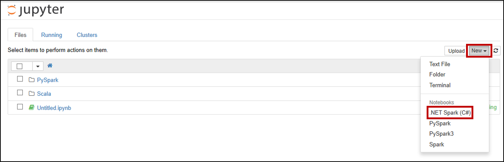

Deploy Spark .Net REPL to HDInsight Spark cluster with Notebook Experience
===

# Table of Contents
This documentation will elaborate the steps on how to deploy Spark .Net REPL to HDI Spark Cluster and submit jobs through Jupyter Notebook using Spark .Net.  
- [Background](#background)
- [Pre-requisites](#pre-requisites)
- [Steps to deploy Spark .Net REPL to HDInsight Spark cluster](#steps-to-deploy-spark-net-repl-to-hdinsight-spark-cluster)
  - [Step 1. Stop Livy Server](#step-1-stop-livy-server)
  - [Step 2. Submit HDInsight Script Action](#step-2-submit-hdinsight-script-action)
  - [Step 3. Start Livy Server](#step-3-start-livy-server)
   - [Step 4. Set up Spark Default Configs](#step-3-start-livy-server)
- [Submit Jobs through Jupyter Notebook](#submit-jobs-through-jupyter-notebook)

## Background
We are currently using [dotnet-try](https://github.com/dotnet/try) as our dotnet REPL. ` dotnet-try ` can be used as a jupyter kernel and we implement it through [livy](https://github.com/apache/incubator-livy) and [sparkmagic](https://github.com/jupyter-incubator/sparkmagic). To enable Jupyter Notebook Experience using Spark .Net, this will include simple manual steps through [Ambari](https://docs.microsoft.com/en-us/azure/hdinsight/hdinsight-hadoop-manage-ambari) and submit [script actions](https://docs.microsoft.com/en-us/azure/hdinsight/hdinsight-hadoop-customize-cluster-linux) on HDInsight Spark cluster.

# Pre-requisites:
Create an [Azure HDInsight spark cluster](https://docs.microsoft.com/en-us/azure/hdinsight/spark/apache-spark-jupyter-spark-sql-use-portal#create-an-hdinsight-spark-cluster) (by visiting the **Azure Portal**, selecting **+ Create a Resource**, and creating a new Azure HDInsight cluster resource), select the **Overview** tab on your cluster. Ensure you've created a cluster with **Spark 2.4** and **HDI 4.0**.

# Steps to deploy Spark .Net REPL to HDInsight Spark cluster
Open the [Azure portal](https://ms.portal.azure.com/#home). Select **HDInsight Spark cluster** you created in the previous step.
## Step 1. Stop Livy Server
1.1 From the portal, select **Overview**, and then select **Ambari home**. If prompted, enter the cluster login credentials for the cluster.

1.2 Select **Spark2**, and then select **LIVY FOR SPARK2 SERVER**.

1.3 Select **hn0... host**, stop **Livy for Spark2 Server** if started. When prompted, click **OK** to proceed.

- Select hn0 as shown below.

- Stop Livy for Spark2 Server.

1.4 Please follow the same step for hn1... host.

## Step 2. Submit HDInsight Script Action
Return to your HDI cluster in the Azure Portal, and select **Script actions** from the options on the left. You'll submit 2 script actions: one to install Livy and Spark Magic, and another to install sparkdotnet and worker.

2.1 Submit Script Action on Head node.
Run `install-livy-sparkmagic-hn.sh` on the cluster using [HDInsight Script Actions](https://docs.microsoft.com/en-us/azure/hdinsight/hdinsight-hadoop-customize-cluster-linux):

* Script type: Custom
* Name: Install Livy and SparkMagic (or anything that is descriptive)
* Bash script URI: The URI to which you uploaded `install-livy-sparkmagic-hn.sh` (e.g. https://<my storage account>.blob.core.windows.net/<my container>/<some dir>/install-livy-sparkmagic-hn.sh)
* Node type(s): Head
* Parameters: None

The following captures the setting for a HDInsight Script Action on Head node:

2.2 Submit Script Action on Worker node.
Run `install-sparkdotnet-wn.sh` on the cluster using [HDInsight Script Actions](https://docs.microsoft.com/en-us/azure/hdinsight/hdinsight-hadoop-customize-cluster-linux):

* Script type: Custom
* Name: Install SparkDotnet (or anything that is descriptive)
* Bash script URI: The URI to which you uploaded `install-sparkdotnet-wn.sh` (e.g. https://<my storage account>.blob.core.windows.net/<my container>/<some dir>/install-sparkdotnet-wn.sh)
* Node type(s): Worker
* Parameters: Sparkdotnet version. For example, if you want to install Sparkdotnet version 0.5.0 then it would be `0.5.0`.

The following captures the setting for a HDInsight Script Action on Head node:

> **Note**: The second script action will likely take longer to run than the first. After you see green check-marks next to the status of both script actions, you can move to the next step.

## Step 3. Start Livy Server
Please follow the above [Step 1](#step-1-stop-livy-server) to **Start** Livy for Spark2 Server.

## Step 4. Set up Spark Default Configs
4.1 From the portal, select **Overview**, and then select **Ambari home**. If prompted, enter the cluster login credentials for the cluster.

4.2 Select **Spark2**, and then Select **CONFIGS**, then click on **Custom spark2-defaults**.

4.3 Click on **Add Property...** to add Spark default settings.
You will add a total of 4 individual properties. Add them 1 one at a time, all using **TEXT** Property Type in Single property add mode. Make sure you don’t have any extra spaces before or after any of the keys/values.
- Property 1:
    - Key:&ensp;&ensp;`spark.dotnet.shell.command`
    - Value: `/usr/share/dotnet-tools/dotnet-try,kernel-server,--default-kernel,csharp`
- Property 2:
    - Key:&ensp;&ensp;`spark.dotnet.packages`
    - Value: `["nuget: Microsoft.Spark, 0.5.0", "nuget: Microsoft.Spark.Extensions.Delta, 0.5.0"]`
- Property 3:
    - Key:&ensp;&ensp;`spark.dotnet.version`
    - Value: `0.5.0`
- Property 4:
    - Key:&ensp;&ensp;`spark.dotnet.interpreter`
    - Value: `try`

For example, the following captures the setting for adding property 1:

After adding those 4 properties, select **SAVE**. If you see a warning screen of config recommendations, select **PROCEED ANYWAY**.

4.4 Restart affected components.
After adding the new properties, you need to restart components that were affected by the changes. At the top, select **RESTART**, and then **Restart All Affected** from the drop-down.

When prompted, select **CONFIRM RESTART ALL** to continue, then click **OK** to finish.

# Submit Jobs through Jupyter Notebook
After finishing previous steps, now you can submit your jobs through Jupyter Notebook!
1. Create a new Spark .NET notebook

[Launch Jupyter notebook](https://docs.microsoft.com/en-us/azure/hdinsight/spark/apache-spark-jupyter-spark-sql-use-portal#create-a-jupyter-notebook) from your HDI cluster in the Azure Portal, then select **New** > **Spark .Net** to create a notebook.

2. Submit Jobs using Spark .Net

> **Note:** After the kernel is ready, then you can start submitting jobs. The following shows a sample to submit jobs through notebook.
- Start a spark session

- Create a Dataframe

- Register Udf and use Udf via data frames

