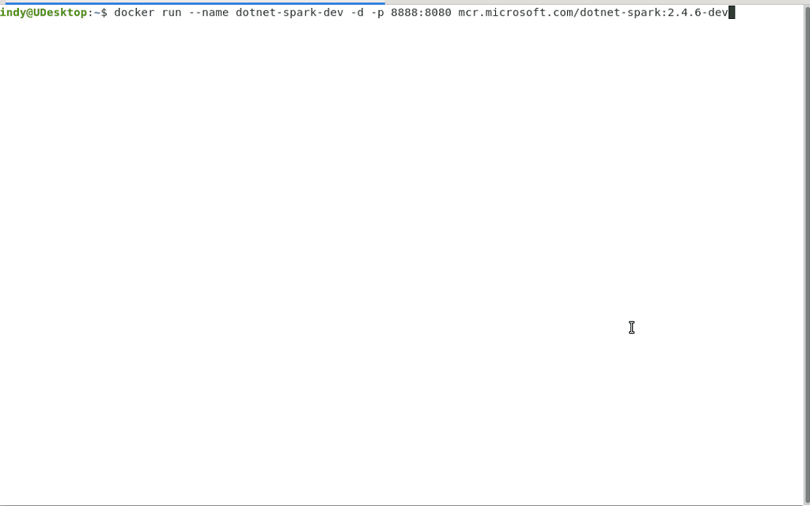
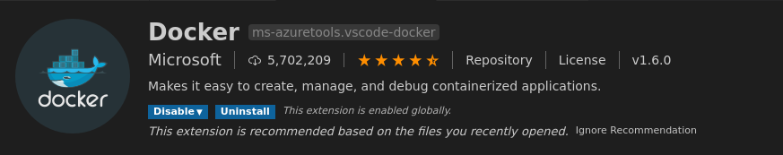
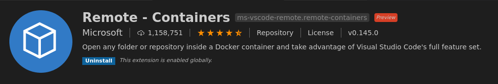
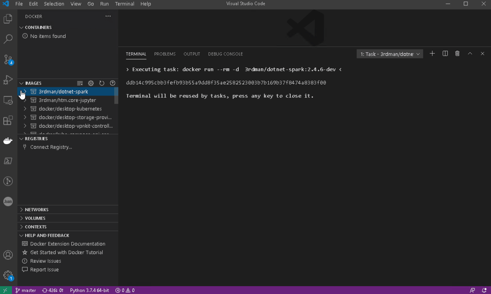

# .NET for Apache Spark dev Docker image

## Description

This directory contains the source code to build a docker development image.
Using this image, you can compile .NET for Apache Spark yourself.

If you do not want to build those images yourself, you can get our pre-built images directly from docker hub at [https://hub.docker.com/r/3rdman/dotnet-spark](https://hub.docker.com/r/3rdman/dotnet-spark).

## Building

To build a dev image, just run the [build.sh](build.sh) bash script. The default Apache Spark and Maven versions used to build the image are defined in the script.

You can also specify different versions, by using one of the following command line options:

```bash
    -a, --apache-spark
    -m, --maven
```

For more details please run

```bash
build.sh -h
```

Please note, that not all version combinations are supported, however.

## Docker Run Example

As mentioned earlier, the dotnet-spark runtime image can be used in multiple ways. Below are some examples that might be useful.

```bash
docker run --name dotnet-spark-dev -d 3rdman/dotnet-spark:dev-latest
```

## Using the image to build from source

- ### Docker interactive terminal

The most basic way to build .NET for Apache Spark from source is to connect to the started container using the following docker command

```bash
docker exec -it dotnet-spark-dev bash
```

As the image comes with a clone of the GitHub repository already, just navigate into the local git repository folder and ensure that you have the most recent version of the source available.

```bash
cd ~/dotnet.spark
git pull
```

Now you can start with [Building Spark .NET Scala Extensions Layer](https://github.com/dotnet/spark/blob/master/docs/building/ubuntu-instructions.md#building).

If you prefer a more GUI based approach, there are a couple of options available as well.

- ### Using [code-server](https://github.com/cdr/code-server)

The image comes with code-server installed, which allows you run Visual Studio Code and build .NET for Apache Spark in a web-browser.

First, start a container from the dev image and map the code-server port to a host port that is reachable via the loopback address only.

```bash
docker run --name dotnet-spark-dev -d -p 127.0.0.1:8888:8080 3rdman/dotnet-spark:dev-latest
```



Now use a web-browser to connect to http://127.0.0.1:8888. This will open Visual Studio Code in the browser. After opening the dotnet.spark repository folder and a new Terminal windows, you can with to the scala source folder and start the build process.

```bash
cd src/scala
mvn clean package
```


- ### VS Code & remote containers

You may also want to give the Docker- and Remote Containers extensions for Visual Studio Code a try






