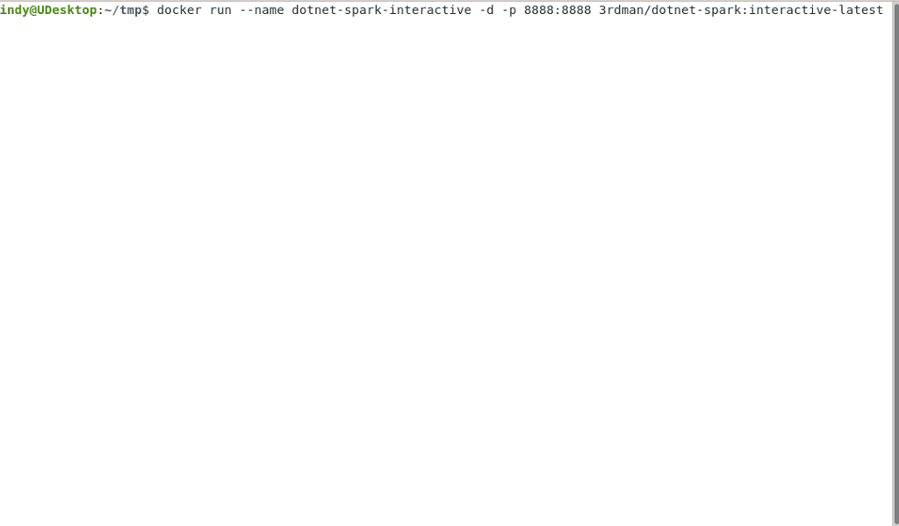
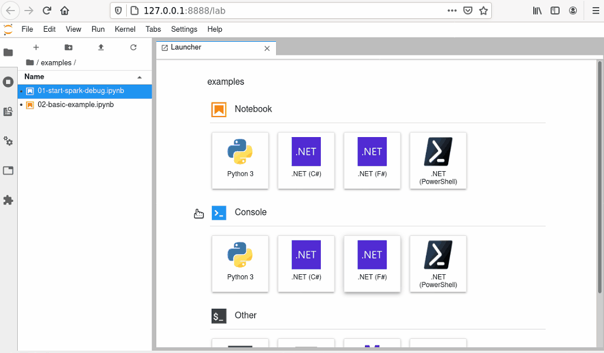
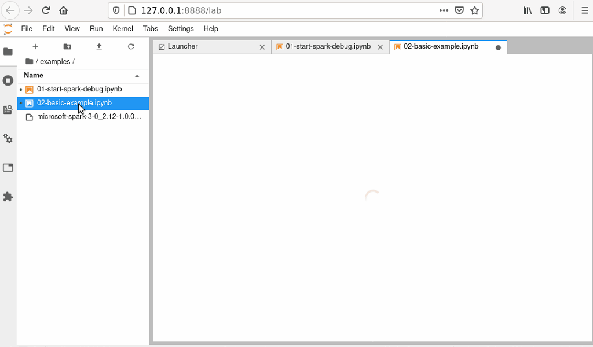

# .NET for Apache Spark interactive Docker image

## Description

This directory contains the source code to build a docker interactive image by using [jupyter/base-notebook](https://hub.docker.com/r/jupyter/base-notebook) as foundation.

## Building

To build the image, just execute the [build.sh](build.sh) bash script. Per default it should build an image using the latest supported versions of .NET Core, Apache Spark and .NET for Apache Spark.

You can also build for different versions, by specifying one of the following options:

```bash
    -a, --apache-spark
    -d, --dotnet-spark
```

For more details please run

```bash
build.sh -h
```

Please note, that not all version combinations are supported, however.

## The image build stages

Using different stages makes sense to efficiently build multiple images that are based on the same .NET core SDK etc, but are using different .NET for Apache Spark or Apache Spark versions.
In that way, dependencies (e.g. .NET Core SDK) do not have to be downloaded again and again, while building an image for a different version. This saves time and bandwidth.

The three stages used in the build process are:

- ### **dotnet-interactive**

  Builds on the jupyter/base-notebook image and installs the .NET Core SDK, along with Microsoft.DotNet.Interactive.

- ### **dotnet-spark-base (interactive)**

  Adds the specified .NET for Apache Spark version to the dotnet-interactive image and also copies/builds the HelloSpark example into the image. HelloSpark is also use to install the correct microsoft-spark-*.jar version that is required to start a spark-submit session in debug mode.

- ### **dotnet-spark (interactive)**

  Gets/installs the specified Apache Spark version and adds the example notebooks.

## Docker Run Example

To start a new container based on the dotnet-spark interactive image, just run the following command.

```bash
docker run --name dotnet-spark-interactive -d -p 8888:8888 3rdman/dotnet-spark:interactive-latest
```

After that, examine the logs of the container to get the correct URL that is required to connect to Juypter using the authentication token.

```bash
docker logs -f dotnet-spark-interactive
```



It is important to start the .NET for Apache Spark backend in debug mode first, before using it in any of the notebooks.

The helper script start-spark-debug.sh can do this for you, as demonstrated below.



Once the backend is running, please open 02-basic-example.ipynb to learn how you can use .NET for Apache Spark in your own notebooks.

