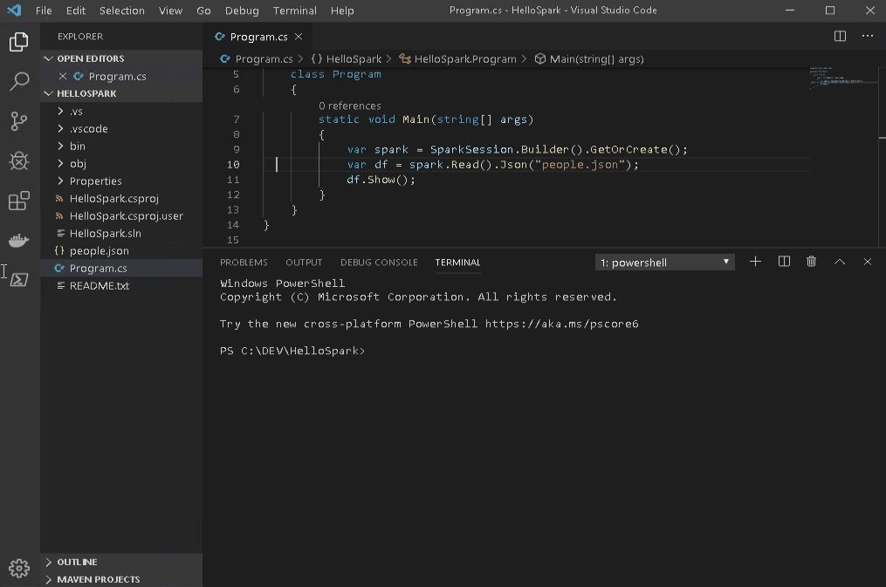

# .NET for Apache Spark runtime Docker image

## Description

This directory contains the source code to build the docker runtime images for different versions of .NET for Apache Spark and [Apache Spark](https://spark.apache.org).

By using these images, you can run and debug your .NET for Apache Spark projects inside a docker container, without the need to set up all required dependencies yourself. This means that you, for example, can

- run a spark master and multiple slaves within the same container.
- run spark master and slave instances in separate containers.
- connect to a .NET for Apache Spark session in debug mode from Visual Studio or Visual Studio Code.

If you do not want to build those images yourself, you can get our pre-built images directly from docker hub at [https://hub.docker.com/r/3rdman/dotnet-spark](https://hub.docker.com/r/3rdman/dotnet-spark).

Additional information on how to use the images can be found at [3rdman.de](https://3rdman.de/tag/net-for-apache-spark/), or the docker hub page mentioned above.

## Building

To build an image just run the [build.sh](build.sh) bash script. Per default it should build an image with the latest supported versions of .NET Core, Apache Spark and .NET for Apache Spark installed.

You can also build for different versions by specifying one of the following options:

```bash
    -a, --apache-spark
    -d, --dotnet-spark
```

For more details please run

```bash
build.sh -h
```

Please note, that not all version combinations are supported, however.

## The image build stages

Using different stages makes sense to efficiently build multiple images that are based on the same .NET core SDK, but are using different .NET for Apache Spark or Apache Spark versions.
In that way, dependencies (e.g. .NET core SDK) do not have to be downloaded again and again, while building images for the  different versions. This saves time and bandwidth.

The three stages used in the build process are:

- ### **dotnet-sdk**

  Downloads and installs the specified .NET Core SDK into a base Ubuntu 18.04 image along with some other tools that might be required by later stages or for debugging. The resulting image is tagged with the .NET Core version number.

- ### **dotnet-spark-base (runtime)**

  Adds the specified .NET for Apache Spark version to the dotnet-sdk image and also copies/builds the HelloSpark example into the image. HelloSpark is also use to install the correct microsoft-spark-*.jar version that is required for using the image for debugging [debugging .NET for Apache Spark](https://docs.microsoft.com/en-us/dotnet/spark/how-to-guides/debug) via Visual Studio, or Visual Studio Code.


  

- ### **dotnet-spark (runtime)**

  Gets/installs the Apache Spark version and copies the related startup scripts into the image.

## Docker Run Examples

As mentioned earlier, the dotnet-spark runtime image can be used in multiple ways. Below are some examples that might be useful.

- ### master and one slave in a single container

 ```bash
docker run -d --name dotnet-spark -p 8080:8080 -p 8081:8081 -e SPARK_DEBUG_DISABLED=true 3rdman/dotnet-spark:latest
```

- ### master and two slaves in a single container

```bash
docker run -d --name dotnet-spark -p 8080:8080 -p 8081:8081 -p 8081:8081 -e SPARK_DEBUG_DISABLED=true -e SPARK_WORKER_INSTANCES=2 3rdman/dotnet-spark:latest
```

- ### master only

```bash
docker run -d --name dotnet-spark-master -p 8080:8080 -p 7077:7077 -e SPARK_DEBUG_DISABLED=true -e SPARK_WORKER_INSTANCES=0 3rdman/dotnet-spark:latest
```

- ### slave only, connecting to external master

```bash
docker run -d --name dotnet-spark-slave -p 8080:8080 -e SPARK_DEBUG_DISABLED=true -e SPARK_MASTER_DISABLED=true -e SPARK_MASTER_URL="spark://master-hostname:7077" 3rdman/dotnet-spark:latest
```

For details about how to use the image for .NET for Apache Spark debugging, please have a look at one of the following posts:

- [.NET for Apache Spark – VSCode with Docker on Linux and df.Collect()](https://3rdman.de/2020/01/net-for-apache-spark-visual-studio-code-with-docker-on-linux/)

- [.NET for Apache Spark – UDF, VS2019, Docker for Windows and a Christmas Puzzle](https://3rdman.de/2019/12/net-for-apache-spark-udf-vs2019-docker-for-windows-and-a-christmas-puzzle/)

- [Debug .NET for Apache Spark with Visual Studio and docker](https://3rdman.de/2019/10/debug-net-for-apache-spark-with-visual-studio-and-docker/)
