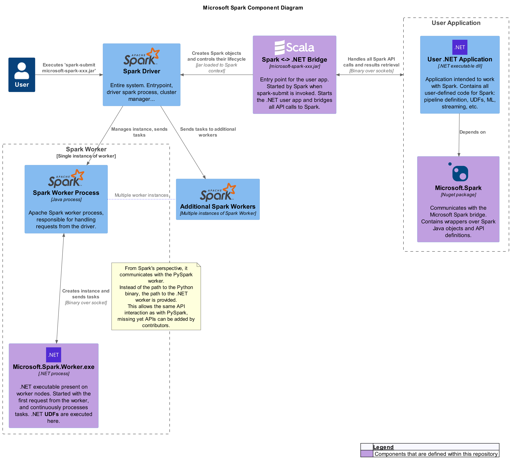
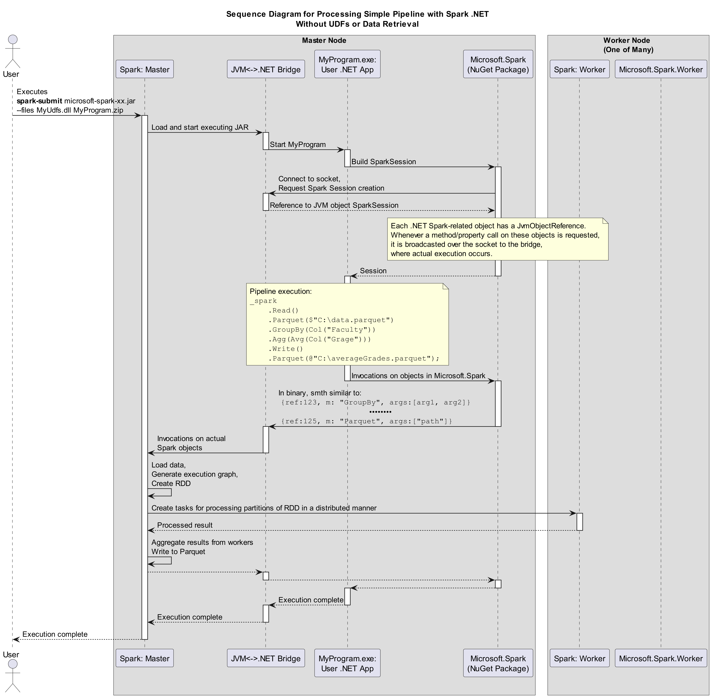
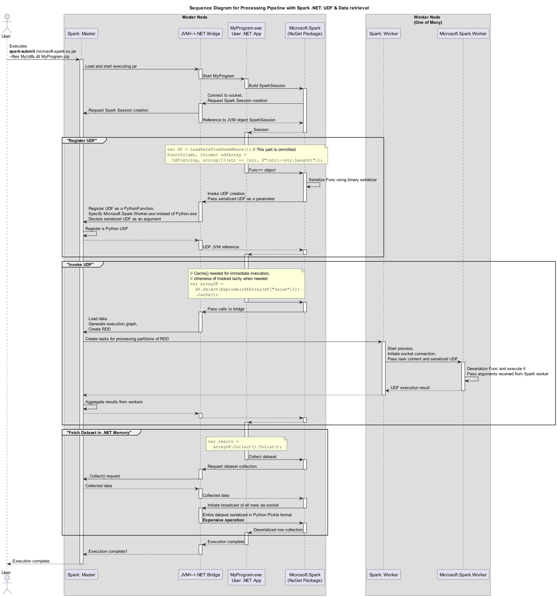

# Components Overview

The following component diagram depicts a high-level overview of the vital components participating in a .NET for Apache Spark application lifecycle:

This diagram illustrates the interaction between the Apache Spark components and the .NET components. The `Microsoft.Spark` NuGet package contains a number of wrappers over the Scala JVM objects (with reference to internal objects mapped in the bridge), and allows calling various methods on those objects. Unless `Collect()` is called on a dataframe, no data is actually loaded into the .NET app; the solution acts as a proxy for the Scala Spark API. Key components include:

- **Spark Driver**: The main entry point for Spark jobs, responsible for managing the job lifecycle and distributing tasks to worker nodes.
- **Spark Worker**: Executes tasks sent by the driver, processing data and performing computations.
- **Microsoft.Spark.Worker**: A .NET executable that runs on worker nodes, allowing .NET UDFs to be executed as part of the Spark job.
- **User .NET Application**: Contains the user-defined code for interacting with Spark, including data processing pipelines, UDFs, and more.
- **JVM<->.NET Bridge**: Facilitates communication between the .NET application and the JVM-based Spark components.

# Pipeline Processing Sequence

## Basic Sequence Diagram

The basic sequence diagram for the application lifecycle is depicted below:

This diagram shows the flow of control and data during the execution of a simple Spark pipeline with .NET, without UDFs or data retrieval. Note that Worker is never instantiated, and no actual pipeline data is transferred to .NET.

## Sequence Diagram with UDFs and Data Retrieval

The sequence diagram below illustrates a more complex scenario involving user-defined functions (UDFs) and data retrieval:

This diagram includes the steps for registering and invoking UDFs, as well as fetching the dataset into .NET memory.
